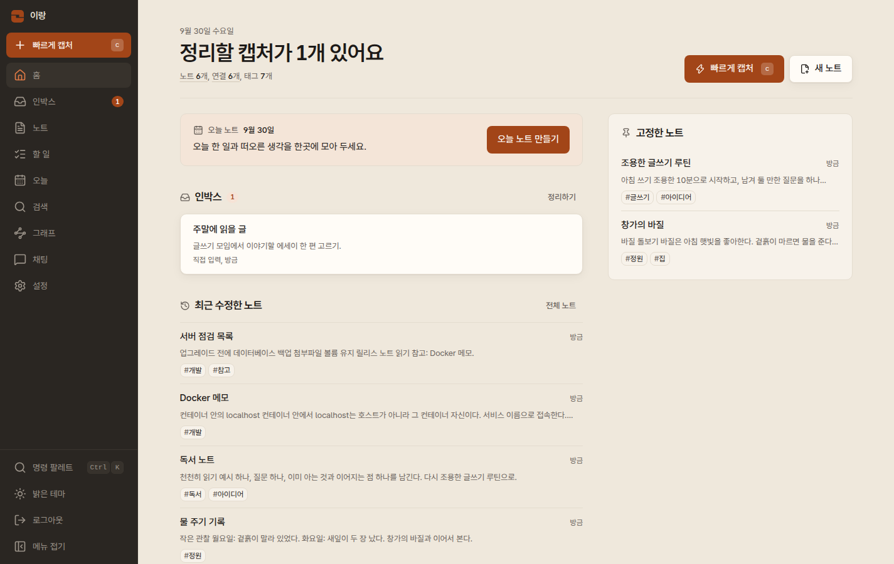

<p align="center">
  
</p>

<h1 align="center">이랑 · Irang</h1>

<p align="center">
  Markdown 노트를 서로 이어 쓰는 1인용 자체 호스팅 노트장.<br>
  <a href="README.md">English</a> · <a href="docs/SETUP.ko.md">한국어 설치 안내</a> · <a href="docs/SETUP.md">English setup</a> · <a href="LICENSE">MIT</a>
</p>

**발음:** /i.ɾaŋ/, 한국어로 "이랑"입니다. 영어로는 *EE-rahng*이며 "eye-rang"이 아닙니다.



이랑은 직접 운영하는 서버에서 소유자 한 명이 쓰는 노트 도구입니다. 링크와 짧은
생각을 인박스에 먼저 담고 Markdown 노트로 옮겨 적으면서, 노트를 서로 연결해
나갈 수 있습니다. 기본 기능에는 AI 계정이 필요하지 않습니다.

## 주요 기능

- **수집과 인박스**: URL이나 짧은 메모를 먼저 저장하고, 정리할 때 노트로
  옮깁니다. 키 하나로 항목을 분류하고, 나중에 다시 보도록 미뤄 두거나 기존
  노트에 합칠 수 있습니다.
- **연결된 Markdown 노트**: `[[위키 링크]]`, 태그, 별칭을 쓰고 노트마다
  백링크와 연결되지 않은 언급을 확인합니다. `[[`를 입력하면 제목과 별칭을
  제안받고, 없는 노트도 바로 만들 수 있습니다. 연결되지 않은 언급은 클릭
  한 번으로 링크로 바꿉니다.
- **일일 노트와 템플릿**: 오늘 노트를 열거나 작은 달력에서 다른 날을 고릅니다.
  템플릿(새 일일 노트용 기본 템플릿 포함)은 `{{date}}`와 `{{title}}`을 채워
  줍니다.
- **할 일**: 노트 곳곳의 `- [ ]` 체크박스를 할 일 페이지 한곳에서 모아 보고,
  그곳이나 노트 미리보기에서 바로 체크합니다.
- **버전 기록과 휴지통**: 노트의 최근 버전을 비교하고 되돌릴 수 있습니다.
  삭제한 노트는 30일 동안 휴지통에 남고, 삭제한 직후에는 바로 되돌릴 수
  있습니다.
- **그래프**: 노트장 전체 또는 한 노트 주변의 연결을 살펴봅니다.
- **검색**: PostgreSQL 전문 검색, 트라이그램, 문자 n-gram을 함께 써서 정확한
  단어는 물론 오타가 섞인 검색어로도 모델 없이 노트를 찾습니다. 별도의 비공개
  로컬 런타임을 설정하면 학습형 본문 조각 검색과 근거 위치를 사용할 수 있습니다.
  [로컬 의미 검색](docs/SEMANTIC-SEARCH.md)을 참고하세요. 가중치는 포함하지 않습니다.
- **첨부파일**: 노트에 붙인 파일을 서버에 함께 보관합니다.
- **Markdown 내보내기**: 설정에서 휴지통 밖의 모든 노트와 첨부파일을 zip
  하나로 내려받습니다. 보관한 노트도 포함됩니다. 각 노트는 YAML
  프런트매터가 붙은 Markdown 파일이 되고, `[[위키 링크]]`는 그대로 유지됩니다.
  첨부파일은 별도 폴더에 담깁니다. 내보낸 파일은 Obsidian 같은 도구에서도
  열 수 있습니다.
- **채팅(선택)**: 노트 내용을 물으면 답변에 참고한 노트를 출처로 보여 줍니다.
  관련 노트를 찾지 못하면 출처 없이 답할 수도 있습니다.
- **Jev(선택)**: 채팅과 따로 연결하며, 인박스 항목의 분류·태그·중복 후보를
  제안합니다. 제안은 항목에 저장되고, 노트로 옮길 때 붙일 태그는 직접 고릅니다.

이랑은 한 사람이 쓰는 웹 앱이라 팀 협업 기능이 없습니다. 네이티브 앱, 오프라인
편집과 동기화, 종단 간 암호화, 내장 가져오기, 자동 백업도 없습니다.

## 빠른 시작

Docker와 **Docker Compose 5.1.0 이상**이 필요합니다. 버전은
`docker compose version`으로 확인합니다. 그보다 오래된 Compose에는 올바른
설정까지 거부할 수 있는 변수 보간 버그가 있습니다. 호스트에 Bun이나 Node는
설치하지 않아도 됩니다. 이미지 지원 플랫폼은 **linux/amd64**, **linux/arm64**입니다.
선택한 릴리스의 워크플로 기록에서 두 플랫폼의 네이티브 이미지, 비공개 다운로드,
데이터 유지 검증을 확인하세요. 절차는 [릴리스 안내](docs/RELEASING.md)에 있습니다.
명령은 POSIX 셸 기준이며 macOS와 Windows에서는 확인하지 않았습니다.

### 릴리스 설치 아카이브

설치 묶음은 `irang-2.3.2-install.tar.gz`입니다. `compose.yml`, 필수 마운트
파일 `docker/postgres/production/01-app-role.sql`, 문서, 고지,
`release.json`이 들어 있습니다. 아카이브의 Compose 파일은 이미지 다이제스트를
고정합니다. 묶음의 디렉터리 구조를 그대로 유지하세요.

**이미지 접근:** 소스 저장소와 GitHub 릴리스 파일은 공개되어 있지만 GHCR
패키지는 비공개이며 이미지를 받으려면 패키지 접근 권한이 필요합니다.
아래 명령은 [릴리스 안내](docs/RELEASING.md)의
검증을 마친 `v2.3.2` 릴리스가 있어야 사용할 수 있습니다. GitHub CLI로 릴리스
파일을 내려받고, `jq`로 이미지 참조를 읽습니다.

```sh
mkdir irang-release-2.3.2
cd irang-release-2.3.2
gh release download v2.3.2 --repo madrobotnet/irang
sha256sum --check SHA256SUMS
tar -xzf irang-2.3.2-install.tar.gz
cd irang

IRANG_IMAGE=$(jq -r .image release.json)
export IRANG_IMAGE
docker pull "$IRANG_IMAGE"
docker run --rm --user "$(id -u):$(id -g)" -v "$PWD":/install \
  "$IRANG_IMAGE" bun --no-env-file /app/scripts/setup-env.mjs /install/.env

# .env 편집: 루프백 HTTP는 INSECURE_COOKIES=1, HTTPS는 0을 유지합니다.
docker compose up -d --wait --wait-timeout 180
curl -i http://127.0.0.1:3000/api/health
```

비공개 GHCR 이미지를 받으려면 별도의 패키지 읽기 권한이 필요합니다.
GitHub CLI의 저장소 인증만으로 Docker 레지스트리 자격 증명이 생기지는 않습니다.
공개 릴리스 파일을 받는 것만으로 비공개 이미지 접근 권한이 생기지는 않습니다.
레지스트리 접근 권한이 없다면 소스에서 빌드하세요.

### 소스에서 빌드

소스 저장소는 공개되어 있으며 이 경로에는 GHCR 접근 권한이 필요하지 않습니다.
Compose에 빌드 설정이 없으므로 이미지를
직접 빌드합니다.

```sh
git clone --branch v2.3.2 --single-branch https://github.com/madrobotnet/irang.git
cd irang
docker build --build-arg VERSION=2.3.2 \
  --build-arg REVISION="$(git rev-parse HEAD)" -t irang:local .
IRANG_IMAGE=irang:local
export IRANG_IMAGE
docker run --rm --user "$(id -u):$(id -g)" -v "$PWD":/install \
  irang:local bun --no-env-file /app/scripts/setup-env.mjs /install/.env

# .env 편집: IRANG_IMAGE=irang:local을 추가합니다.
# 루프백 HTTP는 INSECURE_COOKIES=1, HTTPS는 0을 유지합니다.
docker compose pull db
docker compose up -d --no-build --pull never --wait --wait-timeout 180
curl -i http://127.0.0.1:3000/api/health
```

이어서 `http://127.0.0.1:3000/setup`을 열고 설치 확인 코드와 새 소유자
비밀번호(12자 이상)를 입력합니다.

루프백 HTTP에서는 컨테이너를 다시 만들거나 업그레이드한 뒤에도
`.env`의 `INSECURE_COOKIES=1`을 유지하세요. HTTPS에서는 앱을 다시 만들기 전에 `0`으로
설정합니다.

각 단계에서 하는 일은 다음과 같습니다.

1. `setup-env`는 선택한 앱 이미지 안에서 실행됩니다. 앱 DB 비밀번호, DB 관리자
   비밀번호, 설치 확인 코드(`SETUP_TOKEN`) 세 가지 무작위 비밀 값을 담은 `.env`
   (권한 0600)를 만들고 코드를 한 번 출력합니다. `.env`가 이미 있으면 아무것도
   바꾸지 않고 종료합니다. 호스트에서 `bun install`을 실행해도 이 파일이나
   코드는 생기지 않습니다.
2. Compose는 DB 상태 검사가 통과한 뒤 선택한 이미지를 시작합니다.
   소스 Compose의 기본값은 `ghcr.io/madrobotnet/irang:2.3.2`입니다.
   릴리스 아카이브는 검증된 다이제스트를, 소스 빌드는
   `IRANG_IMAGE=irang:local`을 사용합니다.
3. 앱은 `127.0.0.1`에만 바인딩됩니다. 루프백 HTTP에서만
   `INSECURE_COOKIES=1`을 쓰고, HTTPS에서는 `INSECURE_COOKIES=0`을 사용하세요.

설치 확인 코드는 최초 설정에만 쓰입니다. AI 제공자 계정을 연결할 때 표시되는
일회용 코드와는 다릅니다.

### 화면 없는 서버에서 접속하기

앱이 루프백에만 열려 있으므로 내 컴퓨터에서 SSH 터널을 엽니다.

```sh
ssh -L 3000:127.0.0.1:3000 you@your-server
```

그다음 로컬 브라우저에서 `http://127.0.0.1:3000/setup`을 엽니다.

### 공개 서비스로 운영할 때

루프백 포트 앞에 TLS를 처리하는 리버스 프록시를 두고 `INSECURE_COOKIES=0`을
유지하세요. `Host` 헤더는 그대로 전달하고, `TRUSTED_PROXY_HOPS`는
프록시 구성에 맞춥니다. 자세한 내용은
[쿠키, HTTPS, 리버스 프록시 신뢰](docs/SETUP.ko.md#6-cookies-http-vs-https-and-reverse-proxy-trust)를
참고하세요.

## 기존 설치 업그레이드

> [!WARNING]
> **업그레이드 전에는 항상 백업하세요.** `docker compose down -v`는 데이터
> 볼륨을 삭제하므로 절대 실행하지 마세요.
>
> **1.x 설치**는 다른 볼륨 키(`second_brain_pg18`)와 비밀번호 이름을
> 사용했습니다. 업그레이드 전에
> [기존 배포 이전 절차](docs/SETUP.ko.md#10-existing-deployments)에 따라
> `POSTGRES_DATA_VOLUME`을 지정하고, 기존 `DATABASE_URL`과 비밀번호를
> 유지하고, 컨테이너를 다시 만들기 **전에** 첨부파일을 복사해 두세요. 이전
> Compose 파일은 첨부파일을 보존하지 않았습니다.

2.1 이상 설치는 먼저 백업하세요. 기존 설치 디렉터리, Compose 프로젝트 이름,
`.env`, 물리 데이터 볼륨을 유지합니다. 다음 아카이브의 배포 파일만 교체하고,
그 `release.json`의 이미지를 선택해 내려받은 뒤
`docker compose up -d --wait --wait-timeout 180`을 실행하세요. 소스 설치는
`docker build`로 다시 빌드하고 `IRANG_IMAGE=irang:local`을 유지한 채
`--no-build --pull never`로 다시 만듭니다. 기존 `second-brain` 프로젝트를
새 `irang` 디렉터리로 옮겨서 빈 볼륨을 선택하는 일이 없도록 주의하세요.
`.env`에는 루프백 HTTP용 `INSECURE_COOKIES=1` 또는 HTTPS용 `0`을 유지합니다.
정확한 명령과 백업·복원 절차는
[데이터, 백업, 업그레이드](docs/SETUP.ko.md#9-data-backup-and-upgrades)에 있습니다.

## 데이터와 네트워크

노트, 인박스 항목, 대화, 설정은 직접 운영하는 PostgreSQL에 저장되고, 검색 인덱스도
같은 DB에 있습니다. 첨부파일은 `app-data` 볼륨에 저장됩니다. 서버와 볼륨,
`.env`, 백업을 보호하는 책임은 운영자에게 있습니다.

이랑은 스스로 노트를 외부로 보내지 않습니다. 데이터는 사용자가 직접 설정하거나
실행한 경우에만 서버 밖으로 나갑니다.

- **채팅**: 제공자를 연결하고 데이터 전송에 동의한 뒤, 질문, 최근 대화 12개,
  관련 노트 발췌를 그 제공자에게 보냅니다.
- **Jev**: 연결하고 동의한 뒤, 캡처 제목, 본문 앞 4,000자, 최근 노트 제목과
  ID를 보냅니다.
- **계정 로그인과 자격 증명 갱신**: 해당 제공자의 인증 서비스와 통신합니다.
- **URL 수집**: 서버가 해당 페이지를 가져옵니다.
- **외부 Markdown 리소스**: 이미지 등을 브라우저가 불러올 수 있습니다.
- 리버스 프록시, 패키지 설치와 컨테이너 빌드에도 외부 통신이 발생할 수 있습니다.

두 AI 기능은 기본적으로 꺼져 있습니다. API 키와 계정 인증 정보는 서버에만
보관되고 브라우저로 다시 전달되지 않습니다. 다만 이랑이 네트워크를 전혀 쓰지
않는 오프라인 앱은 아닙니다. AI 전송 동의는 채팅과 Jev에만 적용되고, 그 밖의
네트워크 요청까지 막지는 않습니다.

## AI 제공자(선택)

채팅은 ChatGPT/OpenAI, Claude, Gemini, GitHub Copilot, OpenRouter, xAI,
OpenAI·Anthropic 호환 엔드포인트를 지원합니다. API 키를 쓰거나, 제공자가
허용하는 경우 계정으로 로그인합니다. Jev는 TypeSafe 또는 OpenRouter를
사용합니다. 모델, 로그인 방식, 엔드포인트는
[AI 설정](docs/SETUP.ko.md#8-ai-configuration-optional-per-provider)에 정리되어
있습니다.

**Gemini 계정 로그인 안내.** 이랑은 공식 Gemini CLI의 공개 OAuth 클라이언트로
Google 인증 코드를 직접 교환하고, 추론은 그 CLI로 실행합니다. Google이 이랑을
검토하거나 승인한 것은 아닙니다. Google의
[Gemini CLI 약관 및 개인정보 안내](https://github.com/google-gemini/gemini-cli/blob/main/docs/resources/tos-privacy.md)는
CLI가 사용하는 서비스에 제3자가 직접 접근하는 것을 제한합니다. 이 안내를 읽고
사용 목적에 맞는지 직접 판단하세요. API 키 방식은 언제든 쓸 수 있습니다.

## 개발

Bun 1.4.2와 Docker가 필요합니다. Node 22는 상위 프로젝트 계정 로그인 CLI의
하위 프로세스 테스트 픽스처에만 필요하며, 앱 실행에는 쓰지 않습니다.

```sh
bun install --frozen-lockfile
cp .env.example .env.local
bun run hash-password    # AUTH_PASSWORD_HASH=... 한 줄을 출력
```

출력된 한 줄을 큰따옴표까지 포함해 `.env.local`에 그대로 붙여 넣으세요.
출력에 포함된 `\$`는 유지하세요. 역슬래시를 더 붙이거나 달러 기호를 두 개로
늘리지 마세요. 그다음 개발 DB와 앱을 실행합니다.

```sh
bun run db:up
bun run dev    # http://localhost:3000
```

개발 DB는 별도 `second-brain-dev` Compose 프로젝트로, 55432 포트를 씁니다.
그 밖의 개발 명령과 테스트 DB의 파괴적 작업에 대한 안전장치는
[개발 안내](docs/SETUP.ko.md#12-development-commands-and-test-databases)에 있습니다.

## 문서

- [docs/SETUP.ko.md](docs/SETUP.ko.md): 한국어 설치, HTTPS, 업그레이드, 백업, 복구
- [docs/SETUP.md](docs/SETUP.md): 같은 설치 안내의 영어 원문
- [docs/RELEASING.md](docs/RELEASING.md): 네이티브 이미지 릴리스와 배포 파일 검증
- [docs/ARCHITECTURE.md](docs/ARCHITECTURE.md): 구조와 API 계약
- [docs/SEMANTIC-SEARCH.md](docs/SEMANTIC-SEARCH.md): 선택형 비공개 의미 검색, 인덱싱과 대체 검색

## 프로젝트 후원

이랑이 도움이 된다면 Ko-fi에서 개발을 후원할 수 있습니다.

[](https://ko-fi.com/madrobot)

## 라이선스

이랑의 앱 코드는 [MIT](LICENSE) 라이선스입니다. 의존성, 런타임, 공식 계정
로그인 CLI, 폰트, 컨테이너 운영체제에는 각각의 라이선스와 서비스 약관이
적용됩니다. [THIRD_PARTY_NOTICES.md](THIRD_PARTY_NOTICES.md)를 참고하세요.
이미지는 `/app/licenses`와 `/usr/share/irang/licenses`에 고지와 목록을
보관합니다. 앱 라이선스가 이미지 전체의 라이선스를 바꾸지는 않습니다.
