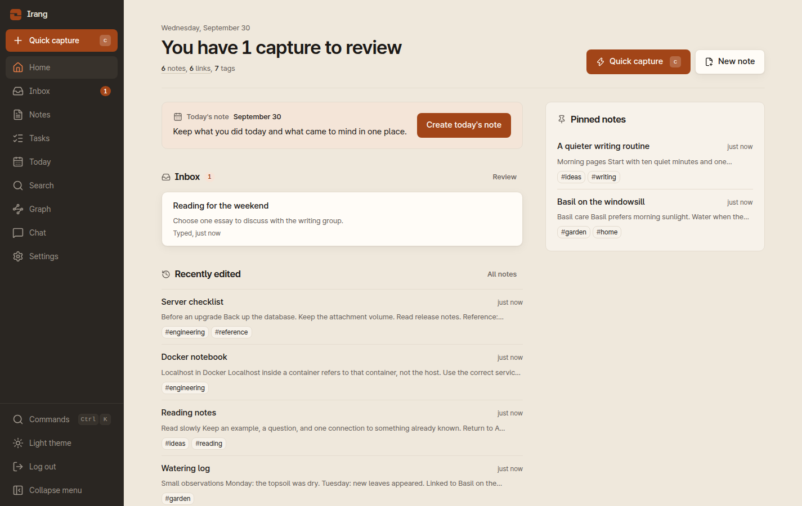

<p align="center">
  
</p>

<h1 align="center">Irang · 이랑</h1>

<p align="center">
  A self-hosted notebook for one person's linked Markdown notes.<br>
  <a href="README.ko.md">한국어</a> · <a href="docs/SETUP.md">Setup guide</a> · <a href="LICENSE">MIT</a>
</p>

**Pronunciation:** /i.ɾaŋ/, said *EE-rahng*. It's not "eye-rang."



Irang runs on your own server and has a single owner. Drop links and quick
thoughts into an inbox, turn them into Markdown notes, and let the connections
between notes build up over time. You won't need an AI account for any of this.

## What it does

- **Capture and inbox.** Save a URL or a quick note first and sort it out later.
  Inbox items become notes when you're ready.
- **Linked Markdown notes.** Link notes with `[[wiki links]]`, add tags and
  aliases, and see backlinks and unlinked mentions on every note.
- **Graphs.** Browse how your notes connect, either across the whole notebook
  or around one note.
- **Search.** PostgreSQL full-text, trigram and character n-gram matching find
  exact words and forgive typos. Search compares text, not meaning: its
  embeddings are local hashed character n-grams rather than learned semantic
  vectors, and no external embedding API is involved.
- **Attachments.** Files are stored on your server next to the notes that use
  them.
- **Optional cited chat.** Ask questions about your notes. Answers drawn from
  matching notes list those notes as sources. When nothing matches, an answer
  may come without note citations.
- **Optional Jev.** A connection kept apart from chat. It suggests
  classifications, tags and possible duplicates for inbox items. Suggestions
  stay with the item, and you pick which tags to apply when you turn it into a
  note.

Irang is a web app for one owner, so it has no team features. It also has no
native apps, offline editing, sync, end-to-end encryption, built-in
import/export or automatic backups.

## Quick start

You need Docker and **Docker Compose 5.1.0 or newer**; check with
`docker compose version`. Older Compose releases have an interpolation bug
that can reject a valid configuration. You don't need Bun or Node on the host.
The commands below use a POSIX shell and were tested on Linux, not on macOS or
Windows.

```sh
git clone https://github.com/madrobotnet/irang.git
cd irang

# One-shot Bun container: writes ./.env and prints your installation code
docker run --rm -v "$PWD":/repo -w /repo --user "$(id -u):$(id -g)" \
  oven/bun:1.4.2-slim bun --no-env-file scripts/setup-env.mjs

# Build the app image from source and start it (loopback HTTP)
INSECURE_COOKIES=1 docker compose up -d --build
```

Then open `http://127.0.0.1:3000/setup`, enter the installation code, and
choose your owner password (at least 12 characters).

Here's what each step does:

1. `setup-env` runs in a throwaway Bun container. It creates a private `.env`
   (mode 0600) with three random secrets: the app database password, the
   database admin password, and the installation code (`SETUP_TOKEN`). It
   prints the code once. If a `.env` already exists, it stops without changing
   anything. Running `bun install` on your machine won't create this file or
   the code.
2. `docker compose up -d --build` builds the app image from this repository's
   `Dockerfile`. There's no prebuilt image to pull. The app starts after the
   database passes its health check.
3. The app listens on `127.0.0.1` only. `INSECURE_COOKIES=1` is for this local
   HTTP check only.

The installation code only works for first-time setup. It isn't the one-time
code an AI provider shows you when you connect an account.

### Using a headless server

Because the app is bound to loopback, open an SSH tunnel from your own machine:

```sh
ssh -L 3000:127.0.0.1:3000 you@your-server
```

Then open `http://127.0.0.1:3000/setup` in your local browser.

### Going public

Put a TLS-terminating reverse proxy in front of the loopback port, keep
`INSECURE_COOKIES=0`, forward the `Host` header unchanged, and set
`TRUSTED_PROXY_HOPS` to match your proxy chain. See
[Cookies, HTTPS and reverse-proxy trust](docs/SETUP.md#6-cookies-http-vs-https-and-reverse-proxy-trust).

## Upgrading existing installs

> [!WARNING]
> **Back up before every upgrade**, and never run `docker compose down -v`,
> because that deletes your data volumes.
>
> **1.x installs** used a different volume key (`second_brain_pg18`) and
> password names. Before upgrading, follow
> [Existing deployments](docs/SETUP.md#10-existing-deployments): set
> `POSTGRES_DATA_VOLUME`, keep your original `DATABASE_URL` and passwords, and
> copy attachments out of the old container **before** recreating it. The old
> Compose file didn't persist attachments.

For 2.1 and later on the same Compose project, back up first, then run
`git pull` and `docker compose up -d --build`. The backup and restore steps are
in [Data, backup and upgrades](docs/SETUP.md#9-data-backup-and-upgrades).

## Your data and the network

Notes, the inbox, chats and settings are stored in your own PostgreSQL. The
search index lives in the same database, and attachments sit in the
`app-data` volume. Protecting the server, the volumes, `.env` and your backups
is up to you.

Irang doesn't send your notes out on its own. Data leaves the server only
through something you set up or do:

- **Chat**, after you connect a provider and tick its data-transfer consent,
  sends your question, the last 12 messages, and matching note excerpts to that
  provider.
- **Jev**, after you connect and consent, sends the capture's title, the first
  4,000 characters of its body, and recent note titles and IDs.
- **Account login and credential refresh** send requests to the provider's sign-in service.
- **Capturing a URL** fetches that page from the server.
- **Remote Markdown resources**, such as images, can load in your browser.
- Your reverse proxy, package installation and container builds can also involve outside traffic.

Both AI features are off by default. API keys and account credentials stay
on the server and are never sent back to the browser. This isn't a
zero-network or fully offline app. AI consent controls chat and Jev, not every network request.

## AI providers (optional)

Chat supports ChatGPT/OpenAI, Claude, Gemini, GitHub Copilot, OpenRouter,
xAI, and any OpenAI- or Anthropic-compatible endpoint. You can use an API key,
or sign in with an account where the provider allows it. Jev runs through
TypeSafe or OpenRouter. Models, login flows and endpoints are listed in
[AI configuration](docs/SETUP.md#8-ai-configuration-optional-per-provider).

**About Gemini account login.** Irang exchanges the Google authorization code
itself, using the public OAuth client of the official Gemini CLI, and runs
inference through that CLI. Google hasn't reviewed or endorsed Irang. Google's
[Gemini CLI terms and privacy notice](https://github.com/google-gemini/gemini-cli/blob/main/docs/resources/tos-privacy.md)
restricts direct third-party access to the services behind the CLI. Read it and
decide whether this mode fits your use. The API-key mode is always available
instead.

## Development

You'll need Bun 1.4.2 and Docker.

```sh
bun install --frozen-lockfile
cp .env.example .env.local
bun run hash-password    # prints an AUTH_PASSWORD_HASH=... line
```

Paste that line into `.env.local` as printed, backslashes included. Then start
the development database and the app:

```sh
bun run db:up
bun run dev    # http://localhost:3000
```

The development database is a separate `second-brain-dev` Compose project on
port 55432. Other commands and the safeguards around destructive test-database
operations are in
[Development commands and test databases](docs/SETUP.md#12-development-commands-and-test-databases).

## Docs

- [docs/SETUP.md](docs/SETUP.md): installation, HTTPS, upgrades, backup, recovery
- [docs/ARCHITECTURE.md](docs/ARCHITECTURE.md): structure and API contracts
- [docs/REBUILD-AUDIT.md](docs/REBUILD-AUDIT.md): reproduced defects and verification results

## License

[MIT](LICENSE).
