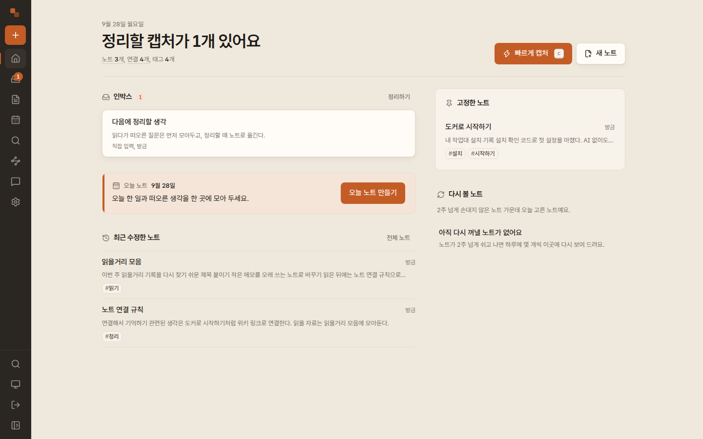

# Second Brain

**생각을 모으고, 노트로 연결하는 개인 지식 작업대.**

`v2.2.0` · Docker로 직접 설치 · [MIT](LICENSE)



*실제 앱에 데모 노트를 저장해 촬영한 화면입니다.*

## 주요 기능

- **수집 → 인박스**: URL과 메모를 먼저 저장하고, 나중에 노트로 승격합니다.
- **노트**: Markdown 편집, `[[위키 링크]]`, 노트 간 연결을 보여주는 그래프 뷰.
- **검색**: PostgreSQL 전문 검색, 트라이그램, 문자 n-gram을 조합합니다. 한국어
  오탈자도 찾아내지만, 학습된 의미 임베딩 검색이 아닙니다.
- **채팅(선택)**: 질문과 최근 대화, 관련 노트 발췌를 모델에 보내고 답변에 노트
  출처 인용을 함께 표시합니다.
- **첨부파일과 홈**: 첨부파일 저장, 브라우저 지역 날짜 기반 홈과 오늘 노트.
- **작업 흐름**: 명령 팔레트와 빠른 수집, 데스크톱 사이드 레일과 모바일 상단
  바·하단 내비게이션, 라이트·다크 테마.

수집, 노트 작성, 검색, 그래프는 AI 설정 없이 동작합니다. AI 연결은 언제나
선택이며, 설정하지 않아도 나머지 기능에 영향을 주지 않습니다.

## Docker 퀵스타트

Linux와 macOS에서 동작합니다. Docker와 **Compose 5.1.0 이상**이 필요합니다.
`docker compose version`으로 확인하세요. 이전 Compose에는 조건부 환경 변수의
보간 버그가 있으므로, 업그레이드 전에 플러그인부터 갱신해야 합니다.

```sh
git clone https://github.com/madrobotnet/second-brain.git
cd second-brain
docker run --rm --user "$(id -u):$(id -g)" \
  -v "$PWD:/workspace" -w /workspace \
  oven/bun:1.4.2-slim bun scripts/setup-env.mjs
INSECURE_COOKIES=1 docker compose up -d --build
```

1. `setup-env.mjs`는 기존 `.env`가 있으면 건드리지 않고 종료합니다. 없으면
   무작위로 만든 앱 DB 비밀번호, DB 관리자 비밀번호, 설치 확인 코드 세 비밀을
   담은 `.env`(권한 0600)를 만들고 설치 확인 코드를 출력합니다. 코드는 서버
   `.env`의 `SETUP_TOKEN`으로도 확인할 수 있습니다.
2. `docker compose up -d --build`는 소스에서 앱 이미지를 빌드하고, `db` 서비스의
   상태 검사가 통과하면 앱을 기동합니다.
3. 빌드와 기동이 끝나면 `http://localhost:3000/setup`에서 출력된 설치 확인 코드와
   새 소유자 비밀번호(12자 이상)를 입력합니다. 선택적으로 같은 화면에서 AI
   연결을 구성할 수 있습니다. 설정이 끝나면 일반 로그인 화면으로 들어가 그
   비밀번호로 로그인합니다.

- 앱 포트는 기본적으로 `127.0.0.1:3000`에만 바인딩됩니다(`APP_PORT`로 변경).
- `INSECURE_COOKIES=1`은 루프백 HTTP 테스트 전용입니다. 공개 호스팅은 HTTPS 뒤에서
  `INSECURE_COOKIES=0`으로 실행하세요. Windows, HTTPS, 업그레이드 절차는
  [docs/SETUP.md](docs/SETUP.md)에 정리되어 있습니다.
- `docker compose down`은 named 볼륨(`postgres-data`, `app-data`)을 유지합니다.
  2.1 이후 같은 Compose 프로젝트의 업그레이드는 백업 후 `git pull`과
  `docker compose up -d --build`로 진행합니다. **1.x 설치는 먼저
  [기존 배포 이전 절차](docs/SETUP.md#10-existing-deployments)에 따라
  `POSTGRES_DATA_VOLUME=second_brain_pg18`을 선택하고 기존 DB URL·암호와
  첨부파일을 보존해야 합니다.** 볼륨 이름을 바꾸거나 `down -v`를 실행하지 마세요.

## 시스템 구성

`compose.yml`은 두 서비스를 띄웁니다.

- `app`: 이 저장소의 `Dockerfile`로 빌드한 Next.js(Bun) 서버. 상태 검사는
  `/api/health`를 사용하고, 첨부파일과 계정 인증 파일은 `app-data` 볼륨의
  `/app/.data` 아래에 둡니다.
- `db`: `pgvector/pgvector:0.8.6-pg18` 이미지의 PostgreSQL. 데이터는
  `postgres-data` 볼륨에 저장합니다. 최초 초기화 때
  `docker/postgres/production/01-app-role.sql`이 `pgcrypto`, `pgvector`,
  `pg_trgm` 확장과 앱 전용 `second_brain` 롤(슈퍼유저, DB 생성, 롤 생성 권한
  없음)을 만들고 필요한 데이터베이스·스키마 권한만 부여합니다.
- DB 비밀은 분리되어 있습니다. 앱은 `POSTGRES_PASSWORD`로 만든 앱 전용 롤로만
  연결하고, `POSTGRES_ADMIN_PASSWORD`가 설정하는 `postgres` 관리자 계정은 앱이
  절대 사용하지 않습니다.

두 서비스 모두 `restart: unless-stopped`이며, 앱은 DB 상태 검사가 통과한 뒤에
시작합니다. 앱 컨테이너 안의 계정 로그인 CLI(Codex, Gemini CLI)는 각자의 인증
흐름을 사용하고, 앱 자체는 Bun으로 실행합니다.

## AI 제공자

첫 셋업에서 연결 이름, 제공자, 연결 방식, 모델을 고릅니다. 이후 설정 화면에서
여러 연결을 추가·수정하고, 채팅과 Jev에 사용할 연결을 각각 선택할 수 있습니다.
사용을 꺼도 저장한 연결은 남으며, 연결 삭제는 별도 동작입니다.
저장하려면 해당 제공자에게 데이터를 보내는 데 명시적으로 동의해야 합니다.

| 제공자 · 용도 | 연결 방식 · 모델 예시 |
| --- | --- |
| OpenAI · 채팅 | API / ChatGPT Auth<br>`gpt-5.4-mini` |
| Claude · 채팅 | API<br>`claude-sonnet-4-6` |
| Gemini · 채팅 | API / Gemini CLI Auth<br>`gemini-2.5-flash` |
| GitHub Copilot · 채팅 | Copilot API 토큰 / GitHub 기기 로그인<br>`gpt-5.4-mini` |
| OpenRouter · 채팅 | API / 브라우저 계정 연결<br>`openai/gpt-5.4-mini` |
| xAI · 채팅 | API / 계정 기기 로그인<br>`grok-4.3` |
| OpenAI Compatible · 채팅 | 사용자 지정 URL·API 키·모델<br>Chat Completions / Responses |
| Anthropic Compatible · 채팅 | 사용자 지정 URL·API 키·모델<br>Messages |
| TypeSafe · Jev | API<br>`jev-latest` |
| OpenRouter · Jev | API / 브라우저 계정 연결<br>`~typesafe/jev-latest` |

ChatGPT와 Gemini Auth는 공식 CLI를, Copilot·OpenRouter·xAI는 앱에서 시작하는
브라우저 로그인을 사용합니다. Claude는 API만 지원합니다. OpenRouter 계정 연결은
API 키를 발급하는 방식이며 구독 이용권을 가져오는 기능이 아닙니다.

커스텀 연결은 추가 헤더와 출력 토큰 한도도 설정할 수 있습니다. 키가 필요 없는
로컬 서버도 지원합니다. Docker 안의 `localhost`는 호스트가 아닌 앱 컨테이너를
뜻합니다. 주소 예시와 로그인 절차는 [AI 설정 안내](docs/SETUP.md#8-ai-configuration-optional-per-provider)를 참고하세요.

모델 이름은 예시일 뿐이며, 실제로 쓸 수 있는 모델은 계정 상태에 따라 다릅니다.
설정 화면은 저장된 구성과 실제 연결 확인을 구분해서 보여주므로,
저장했다고 해서 연결이 검증된 것은 아닙니다.

### 데이터 전송 경계

- 채팅은 질문, 최근 대화 이력(마지막 12개), 검색으로 고른 관련 노트 발췌를
  선택한 제공자에 보냅니다.
- Jev는 캡처 제목, 본문 앞 4,000자, 최근 노트 제목·ID를 보내 인박스
  분류와 태그를 제안합니다. 제안은 선택해야만 노트에 적용됩니다.
- 입력한 API 키는 설정 폼 메모리에서만 다루고, 저장 후에는 다시 내려주지 않습니다.
  추가 헤더 값과 계정 인증 토큰도 서버에만 보관합니다.
- 채팅과 Jev는 선택한 연결 또는 명시적인 꺼짐 상태를 각각 따릅니다. 기존 환경
  변수 기반 구성(`TYPESAFE_API_KEY`, `CODEX_*`)은 해당 용도의 환경 설정 유지를
  선택하면 계속 사용할 수 있습니다. 사용하지 않는 연결을 추가해도 활성화되지 않습니다.

## 데이터와 프라이버시

- 노트, 캡처, 대화, 설정은 자체 PostgreSQL에 저장되고 검색 인덱스도 같은 DB에서
  만듭니다. 첨부파일은 `app-data` 볼륨의 `/app/.data/attachments`에 저장됩니다.
- 로그인은 Argon2 해시로 검증합니다. `AUTH_PASSWORD_HASH`가 설정되어 있으면 이
  값이 항상 권위 있고, 설정 마법사가 만든 소유자 비밀번호는 해시가 없을 때만
  쓰입니다. 설정이 끝난 서버는 마법사를 다시 노출하지 않습니다.
- 세션 쿠키는 기본적으로 보안 쿠키이며, 앱은 검색 엔진 색인을 배제합니다.
- 종단 간 암호화, 오프라인 동기화, 자동 백업은 제공하지 않습니다. 서버, DB
  볼륨, `.env`, 인증 파일, DB 덤프의 보호는 운영자의 책임입니다.
- DB 구조 변경은 앱이 최초 연결 시 버전별 마이그레이션을 트랜잭션으로 적용하고
  `schema_migrations`에 기록합니다. 운영 적용 전에는 DB와 첨부파일을 백업하고
  복사본에서 먼저 확인하세요.

## 백업

서비스가 실행 중일 때 DB 전체를 앱 롤로 내보냅니다.

```sh
BACKUP_FILE=$(mktemp "$HOME/second-brain-backup.XXXXXX")
docker compose exec -T db pg_dump -U second_brain second_brain > "$BACKUP_FILE"
```

덤프에는 노트, 캡처, 대화, 설정이 모두 들어 있으므로 민감한 데이터로 취급하고
안전한 곳에 보관하세요. 위 파일은 저장소 밖에 권한 0600으로 생성됩니다.
첨부파일은 `app-data` 볼륨 안에 있으므로 함께 백업해야
합니다. 업그레이드 전 백업과 복원 절차는 [docs/SETUP.md](docs/SETUP.md)를
참고하세요.

## 개발

Bun 1.4.2와 Docker가 필요합니다. 개발 DB는 `docker-compose.dev.yml`로
`127.0.0.1:55432`에서 실행됩니다.

```sh
bun install --frozen-lockfile
bun run db:up
bun run dev          # http://localhost:3000
```

`.env.local`은 `.env.example`을 복사해 만들고, `bun run hash-password`가
출력하는 `AUTH_PASSWORD_HASH=...` 한 줄로 빈 항목을 채웁니다. 출력된 역슬래시는
Next 환경 변수 확장에서 Argon2 해시의 `$`를 지키는 값이므로 제거하지 마세요.

개발 DB는 `second-brain-dev`라는 별도 Compose 프로젝트를 사용합니다.
이전 버전의 개발 DB가 55432 포트를 사용 중이면 필요한 데이터를 백업하고
그 개발 컨테이너를 종료한 뒤 시작하세요.

| 명령 | 설명 |
| --- | --- |
| `bun run db:up` / `bun run db:down` | 개발 DB 기동 / 개발 DB 컨테이너·볼륨 삭제(운영 DB와 무관) |
| `bun run seed` | 연결된 한국어 예제 노트와 캡처 추가(기존 데이터 유지) |
| `bun run hash-password` | dotenv용 `AUTH_PASSWORD_HASH=...` 생성(대화형) |
| `bun scripts/hash-password.mjs` | 원본 PHC 해시 출력(Docker `--env-file`용) |
| `bun run setup-env` / `bun run setup-token` | 설치 비밀 `.env` 생성 / 새 설치 확인 코드(`SETUP_TOKEN`) 생성·출력 |
| `bun run database-url` | 특수문자가 있는 비밀번호를 퍼센트 인코딩한 연결 문자열 생성 |
| `bun run typecheck` · `bun run lint` · `bun test` · `bun run build` | 검증과 빌드 |

테스트용 `second_brain_test` DB는 개발 DB 초기화 시 별도로 만들어지므로 테스트가
개발 노트를 지우지 않습니다. 테스트 DB 주소는 `TEST_DATABASE_URL`로 바꿀 수
있지만 운영 DB를 지정하면 안 됩니다.

`bun run db:down`은 로컬 개발 DB와 볼륨을 삭제합니다. 운영 데이터는 이 명령이
아니라 compose의 named 볼륨으로 관리되며, 운영 볼륨을 유지하려면 일반
`docker compose down`을 사용하세요.

주요 스택: Next.js(Webpack 실행 옵션), React, Tailwind CSS, CodeMirror 기반
Markdown 편집기, 자체 호스팅 Pretendard 서체. 빌드와 서버 실행은 모두 Bun으로
합니다.

## 문서

- [docs/ARCHITECTURE.md](docs/ARCHITECTURE.md) — 구조와 API 계약
- [docs/SETUP.md](docs/SETUP.md) — Windows, HTTPS, 업그레이드 상세 절차
- [docs/REBUILD-AUDIT.md](docs/REBUILD-AUDIT.md) — 재현한 결함과 실제 검증 결과
- [docs/research/ADOPTION.md](docs/research/ADOPTION.md) — 채택한 패턴과 근거

## 라이선스

MIT 라이선스로 배포합니다. 전문은 [LICENSE](LICENSE)에 있습니다.
